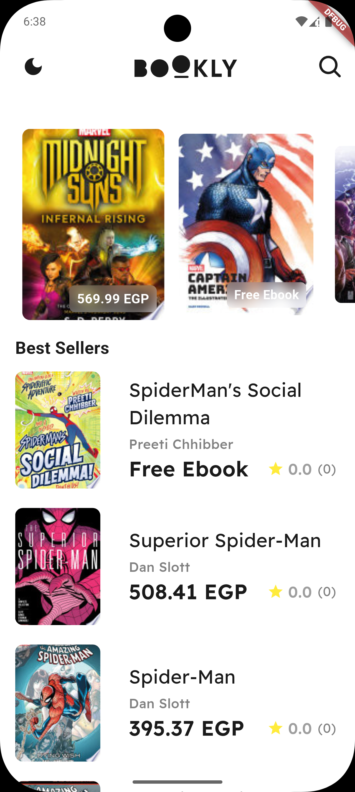
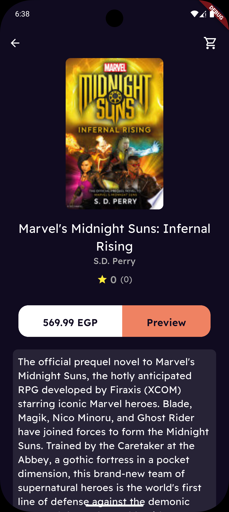
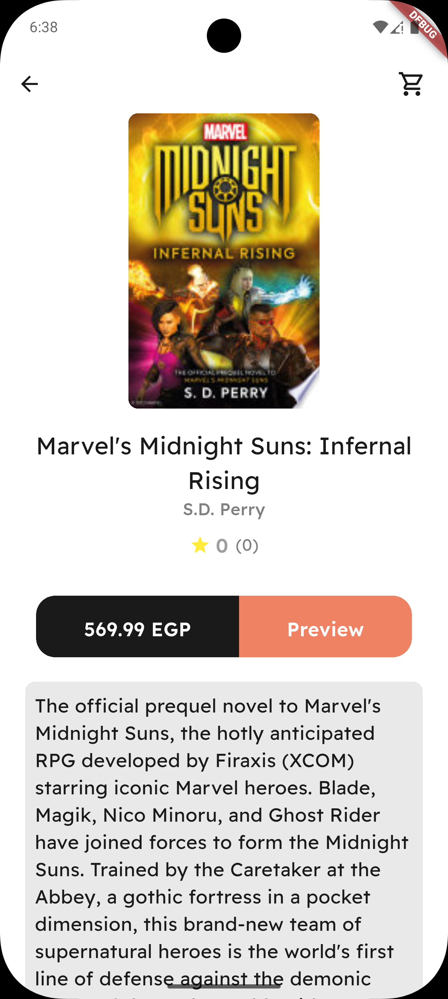
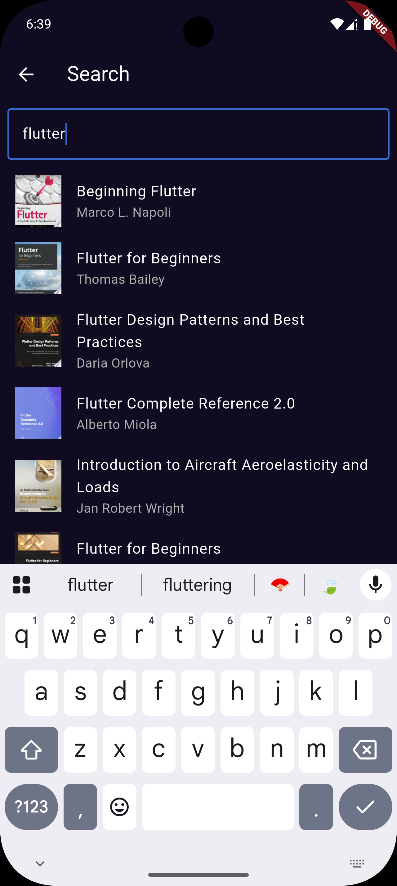
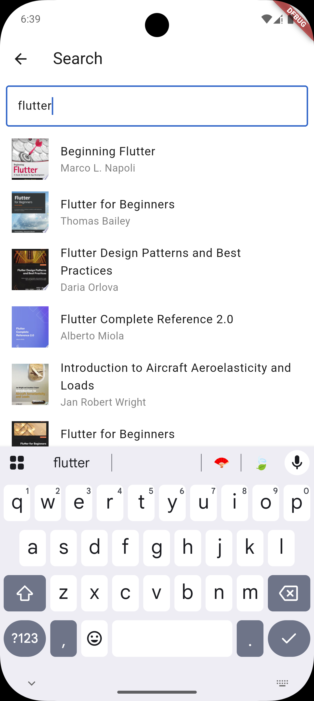
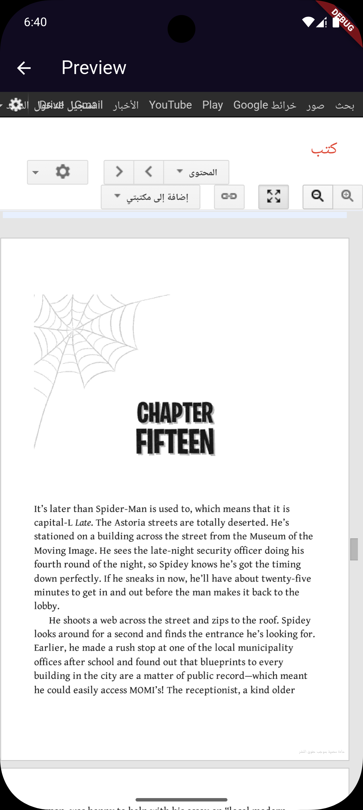
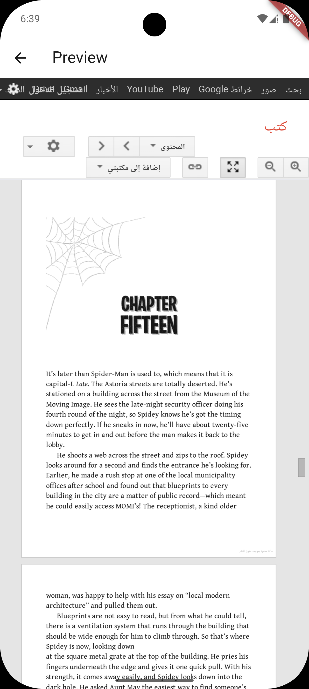
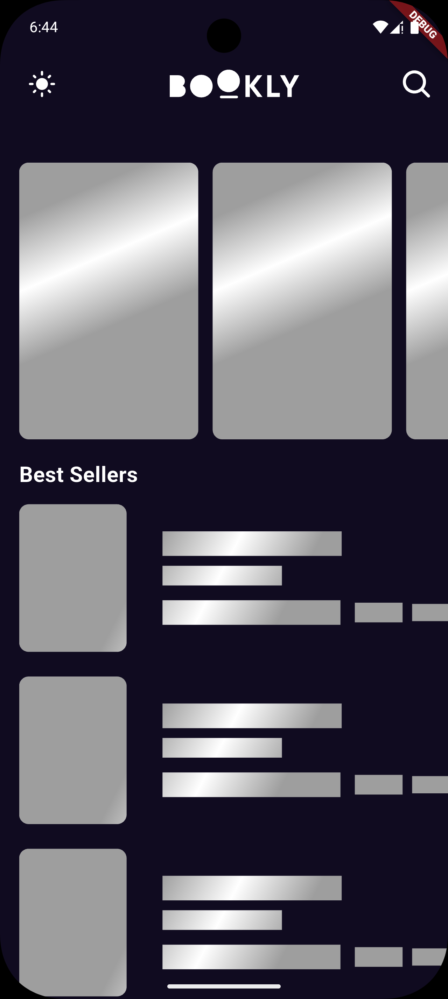
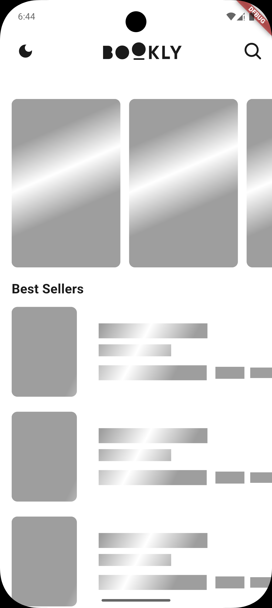

# 📚 Books App

A clean and minimal **Flutter** application to explore books in real-time using the **Google Books API**.  
Users can search for books, browse bestsellers, view details, and open book previews.  

---

## 🚀 Features
- 🔎 Search for books by keyword (live search with debounce)  
- 🏆 Browse Best Sellers  
- 🖼️ Carousel of featured books  
- 📖 View book details including title, author, and thumbnail  
- 🌐 Open book preview in a web view  
- 🔄 Pull-to-refresh to update best sellers and carousel  
- ⚡ Fast performance with Dio HTTP client  
- 📱 Responsive UI for different screen sizes  

---

## 🛠️ Technologies Used
- **Flutter**  
- **Dart**  
- **Dio** (for HTTP requests)  
- **Google Books API** (book provider)  
- **Bloc / Cubit** (state management)  
- **GoRouter** (navigation)  
- **Flutter ScreenUtil** (responsive UI)  

---

## 📸 Screenshots

| Dark Mode | Light Mode |
|-----------|------------|
|  |  |
|  |  |
|  |  |
|  |  |
|  |  |

---

### 📌 Notes
This project was built for learning purposes with Flutter, GoogleBooksAPI. It is not intended for commercial use.
